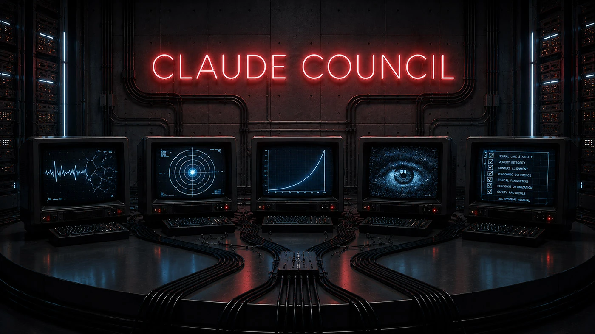

Claude is a master of two extremes. By default it agrees with you and makes you believe you are always right, and when told to be skeptical it swings the other way, criticizing whatever you put in front of it, even when you are right. A single conversation with Claude gives you one answer that lives at one of those extremes.

Claude Council gives you ten that argue with each other, then delivers a single verdict with the disagreement named explicitly. The same question is run through five passes locked into different angles, so they cannot collapse into agreement. Five reviewers then critique the analysis, including one that defends the answer most likely to be dismissed and one that attacks the answer most likely to be accepted, so the criticism cannot collapse into reflexive negativity either. A final synthesis pulls everything together with the strongest dissenting view named so it cannot be smoothed away.

The whole pipeline runs as a Claude Code skill, makes 13 to 14 agent calls per session, and produces an HTML report you can read in a browser along with a transcript of every reasoning step.

---

## HOW IT WORKS

```
frame question
    → optional research pass (only when external evidence exists)
    → 5 analytical passes (parallel)
    → Gate 1: quality check
    → 5 review passes (parallel, anonymized)
    → synthesis (with minority position preserved)
    → Gate 2: audit
    → HTML report + markdown transcript
```

### Why the five passes are different from each other

Running the same prompt five times produces five versions of the same answer. The council uses five different angles instead, each one looking for something the others cannot see.

| Pass | What it looks for |
| --- | --- |
| Failure Analysis | The flaw that breaks the decision under real conditions |
| First Principles | What the question is actually asking beneath its framing |
| Maximum Upside | The upside nobody else is naming |
| Fresh Eyes | What zero-context observation catches that familiarity hides |
| Execution | Whether this can actually be done, and what the first step is |

Each pass is told what to look for, not who to be. Telling an AI "you are The Contrarian" produces theatrical behavior. Telling it "look for what could fail" produces analysis.

### What each pass draws on

Each pass searches a 25-note knowledge base of compiled book notes (Taleb, Kahneman, Munger, Pearl, Meadows, Goldratt, Rumelt, and others) before reasoning, so its analysis draws on established frameworks rather than reasoning from scratch. If no note applies to the question at hand, the pass returns an explicit null result and reasons from first principles instead.

**Failure Analysis:**  
considers fat tails, overconfidence, calibration and reference classes, multi-bias amplification, pre-mortem reasoning, false consensus, hidden motives, manipulation and frame control, power dynamics, disruption blindness, and hard-decision pressure.

**First Principles:**  
applies mental models, causal inference, systems and leverage points, category creation and reframing, strategy as diagnosis, the strategy cascade, and game-theoretic commitment.

**Maximum Upside:**  
explores last-mover advantage, positioning and category design, disruption trajectory, where-to-play framing, status and signaling leverage, and strategic expansion.

**Fresh Eyes:**  
picks up on hidden motives, expert overconfidence and insider capture, group contagion, power dynamics, status display, manipulation, and schema persistence.

**Execution:**  
weighs constraint and throughput, decisive action and anti-paralysis, execution under pressure, stoic discipline, activation and first moves, and moves and countermoves.

### Why the reviewers each do a different job

The five reviewers receive all the analytical responses anonymized as A through E, so no reviewer can weight by source. Each applies a different lens. No two reviewers do the same job.

| Lens | What it does |
| --- | --- |
| Convergence | Finds where multiple passes independently reached the same point |
| What the Room Missed | Identifies what all five failed to address |
| Against the Best Answer | Stress-tests the strongest response |
| For the Weakest Answer | Defends the most likely to be dismissed |
| Combinations | Finds what two passes produce together that neither has alone |

### Optional research grounding

For questions where external evidence exists, such as tool comparisons, technology choices, or market questions, the council runs a research pass first. It searches for data, comparable decisions, and documented failure patterns, then shares what it finds as context that all five passes reason from. The research pass runs only when the question has something to search for. Personal decisions, internal strategy, and questions without external signal skip it.

---

## INSTALL

```
git clone https://github.com/Hiro-Inagawa/claude-council.git
cd claude-council
bash install.sh
```

The installer copies `skills/claude-council/` to `~/.claude/skills/claude-council/`.

**Then set your output folder** in `~/.claude/skills/claude-council/SKILL.md`:

```
OUTPUT_FOLDER: ~/claude-council
```

Change this to wherever you want session files to land.

---

## REQUIREMENTS

- Claude Code (any version that supports the `Agent` tool)
- The skill uses `model: inherit`, so reasoning depth is controlled by whichever model you run Claude Code in

---

## USAGE

Say any of these to Claude:

**Always triggers:** `council this` / `run the council` / `war room this` / `pressure-test this` / `stress-test this` / `debate this`

**Triggers when combined with a decision:** `should I X or Y` / `which option` / `I can't decide` / `I'm torn between` / `validate this`

Does not trigger on factual questions, creation tasks, or casual "should I" without stakes.

---

## OUTPUT

Each session writes two files to `<OUTPUT_FOLDER>/<topic-slug>/`:

- `council-report-YYYY-MM-DD_HHMM.html`, a self-contained HTML file with no JS dependencies. Synthesis at the top (including minority position and disposition), analytical stances grid, collapsible full responses.
- `council-transcript-YYYY-MM-DD_HHMM.md`, the full session record containing the A through E mapping, all 5 analytical responses, all 5 review outputs, synthesis, and audit result.

Multiple sessions on the same topic share the folder. Different timestamps distinguish them.

---

## WHEN TO USE IT

| Use the council | Skip it |
| --- | --- |
| A tradeoff with no obvious right answer | A factual question with one correct answer |
| The assumption needs challenging | A creation or processing task |
| The cost of being wrong is measurable | A casual question with no meaningful stakes |

---

## FILE LAYOUT

```
skills/claude-council/
├── SKILL.md
├── agents/
│   ├── researcher.md              ← optional research pass (Step 0)
│   ├── contrarian.md              ← Failure Analysis pass
│   ├── first-principles-thinker.md
│   ├── expansionist.md            ← Maximum Upside pass
│   ├── outsider.md                ← Fresh Eyes pass
│   ├── executor.md                ← Execution pass
│   ├── response-quality-checker.md   ← Gate 1
│   ├── reviewer-synthesizer.md
│   ├── reviewer-gap-finder.md
│   ├── reviewer-skeptic.md
│   ├── reviewer-devil.md
│   ├── reviewer-integrator.md
│   ├── chairman.md
│   └── chairman-auditor.md           ← Gate 2
├── templates/
│   └── report.html
└── references/
    ├── naming-conventions.md
    ├── workflow-examples.md
    └── council-knowledge-routing.md   ← framework library for vault retrieval
```

See `skills/claude-council/SKILL.md` for the full workflow.
