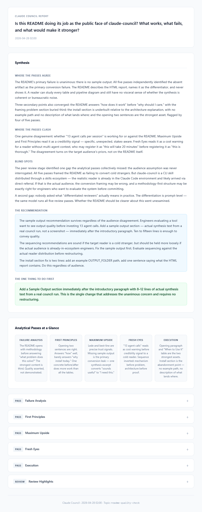

# Claude Council

A Claude Code skill that runs a high-stakes decision through 5 independent analytical passes, has them peer-reviewed by 5 differentiated reviewers, then synthesizes a verdict into two timestamped artifacts: an HTML report and a markdown transcript.

13–14 agent calls per session. Built for decisions where being wrong is expensive.

---

## Sample Output

The following is the "Where the Passes Agree" section from an actual council run on the question: *"Is this README doing its job as the public face of claude-council?"*

> The README's primary failure is unanimous: there is no sample output. All five passes independently identified the absent artifact as the primary conversion failure. The README describes the HTML report, names it as the differentiator, and never shows it. A reader can study every table and pipeline diagram and still have no visceral sense of whether the synthesis is coherent or bureaucratic noise.
>
> Three secondary points also converged: the README answers "how does it work" before "why should I care," with the framing problem section buried third; the install section is underbuilt relative to the architecture explanation, with no example path and no description of what lands where; and the opening two sentences are the strongest asset, flagged by four of five passes.

The synthesis then identifies a genuine disagreement across the passes (whether "13 agent calls" reads as a credibility signal or a cost warning), a blind spot the passes collectively missed (the audience assumption was never interrogated), and a single concrete recommendation that survives the disagreement.



---

## How It Works

### The framing problem

One AI gives one answer within one framing. The problem is not that the answer will be wrong but that there is no structural way to know whether the framing is right. A question framed one way produces an answer that cannot see what a different framing would catch.

### Research grounding

For questions where external evidence exists (tool comparisons, technology choices, best practices, market questions), the council runs an optional research pass before the analytical passes begin. It searches for real-world data, comparable decisions, and documented failure patterns, then shares what it finds as context that all five passes reason from.

The research pass runs only when the question has something to search for. Personal decisions, internal strategy, and questions without external signal skip it.

### Five structurally distinct passes

The council runs five analytical passes in parallel. Each is locked into a structurally different mode so the same question gets forced through angles that cannot reinforce each other's blind spots.

| Pass | What it looks for |
|---|---|
| Failure Analysis | The specific flaw that breaks the decision under real conditions |
| First Principles | What the question is actually asking beneath its framing |
| Maximum Upside | The upside nobody else is naming |
| Fresh Eyes | What zero-context observation catches that familiarity hides |
| Execution | Whether this can actually be done, and what the first step is |

Five is the number where genuine disagreement becomes reliable. With three passes the result is typically two aligned and one outlier that the synthesis can dismiss by weight. With five, it must actually reckon with the disagreement.

### Differentiated peer review

The five review passes receive all analytical responses anonymized (A–E) and each apply a different critical lens. The critical design choice is that no two reviewers do the same job.

| Lens | What it does |
|---|---|
| Convergence | Finds where multiple passes independently reached the same point |
| What the Room Missed | Identifies what all five failed to address |
| Against the Best Answer | Stress-tests the strongest response |
| For the Weakest Answer | Defends the most likely to be dismissed |
| Combinations | Finds what two passes produce together that neither has alone |

The "Against" and "For" passes are the most important in this stage, because nothing escapes challenge regardless of how well-formed it looks, and no outlier gets dismissed by weight of consensus rather than by argument.

### Analytical instruction over roleplay

The agents use direct perspective instruction rather than identity assignment. Telling an AI "you are The Contrarian" activates theatrical behavior rather than genuine critical thinking. Telling it "approach this from the angle of failure" specifies what to think about rather than who to be, which produces sharper output.

### Two quality gates

Two checkpoints prevent weak output from corrupting downstream stages.

| Gate | Runs after | Failure action |
|---|---|---|
| Gate 1 | Analytical passes | Surfaces the failing pass to the user; blocks review |
| Gate 2 | Synthesis | One synthesis re-run with specific corrections |

The gates guard against different failure modes. Gate 1 catches input quality problems, because a weak analytical response does not get corrected at the review stage and gets amplified instead. Gate 2 catches output fidelity problems, because strong inputs can still produce a synthesis that misrepresents them through compression or selective emphasis.

### Pipeline

```
frame question
    → research pass (optional: tool/tech/market questions)
    → 5 analytical passes (parallel)
    → Gate 1: quality check
    → write A–E mapping to disk
    → 5 review passes (parallel, anonymized)
    → synthesis
    → Gate 2: audit
    → HTML report + markdown transcript
```

The A–E mapping is written to disk before the review stage begins. In a 13–14 call pipeline, context compression is a real risk and writing the mapping to disk before review protects against silent failure in the synthesis step.

---

## Install

```bash
git clone https://github.com/Hiro-Inagawa/claude-council.git
cd claude-council
bash install.sh
```

The installer copies `skills/claude-council/` to `~/.claude/skills/claude-council/`.

**Then set your output folder** in `~/.claude/skills/claude-council/SKILL.md`:

```
OUTPUT_FOLDER: ~/claude-council
```

Change this to wherever you want session files to land.

---

## Requirements

- Claude Code (any version that supports the `Agent` tool)
- The skill uses `model: inherit`, so reasoning depth is controlled by whichever model you run Claude Code in

---

## Usage

Say any of these to Claude:

**Always triggers:**
`council this` / `run the council` / `war room this` / `pressure-test this` / `stress-test this` / `debate this`

**Triggers when combined with a real decision:**
`should I X or Y` / `which option` / `I can't decide` / `I'm torn between` / `validate this`

Does not trigger on factual questions, creation tasks, or casual "should I" without real stakes.

---

## Output

Each session writes two files to `<OUTPUT_FOLDER>/<topic-slug>/`:

- `council-report-YYYY-MM-DD_HHMM.html`, a self-contained HTML file with no JS dependencies. Synthesis at the top, analytical stances grid, collapsible full responses.
- `council-transcript-YYYY-MM-DD_HHMM.md`, the full session record containing the A–E mapping, all 5 analytical responses, all 5 review outputs, synthesis, and audit result.

Multiple sessions on the same topic share the folder; different timestamps distinguish them.

---

## When to Use It

| Use the council | Skip it |
|---|---|
| Real tradeoff, no obvious right answer | Factual question with one correct answer |
| The assumption needs challenging | Creation or processing task |
| The cost of being wrong is measurable | Casual question with no meaningful stakes |

---

## File Layout

```
skills/claude-council/
├── SKILL.md
├── agents/
│   ├── researcher.md              ← optional research pass (Step 0)
│   ├── contrarian.md              ← Failure Analysis pass
│   ├── first-principles-thinker.md
│   ├── expansionist.md            ← Maximum Upside pass
│   ├── outsider.md                ← Fresh Eyes pass
│   ├── executor.md                ← Execution pass
│   ├── response-quality-checker.md   ← Gate 1
│   ├── reviewer-synthesizer.md
│   ├── reviewer-gap-finder.md
│   ├── reviewer-skeptic.md
│   ├── reviewer-devil.md
│   ├── reviewer-integrator.md
│   ├── chairman.md
│   └── chairman-auditor.md           ← Gate 2
├── templates/
│   └── report.html
└── references/
    ├── naming-conventions.md
    └── workflow-examples.md
```

See `skills/claude-council/SKILL.md` for the full workflow.
